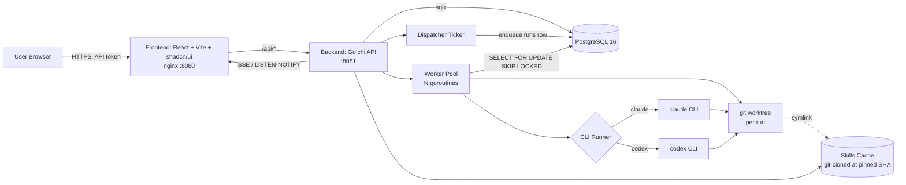

# PRD — mini-Paperclip: Local Multi-Agent Engineering Orchestrator

**Status:** Draft v1 · **Owner:** ignas · **Date:** 2026-05-16
**Supersedes:** `RESEARCH.md`, `RESEARCH2.md`, `PLAN.md` (kept for historical context)

---

## 1. Executive Summary

mini-Paperclip is a single-machine, Go-powered orchestrator that runs a small "AI engineering team" — PM, EM, Backend, Frontend, and QA agents — against the user's own local git repositories. Agents collaborate through a Kanban board (blackboard pattern, no peer-to-peer chat). Each agent is a thin wrapper around the user's locally installed `claude` or `codex` CLI plus a curated set of **skills** sourced from upstream repos (`verzth/skills`, `ace3/skills`). A heartbeat loop wakes agents on a schedule, gives them one task at a time, parses a strict JSON response, and writes back tasks/comments — providing an auditable, restartable engineering loop you can leave running 24/7.

**Success looks like:** the user creates a project, attaches a local repo, files a single high-level task ("implement password reset"), and watches the PM agent plan, the EM agent decompose, the Backend agent implement, the QA agent verify — all driven by the heartbeat — with every action visible on a Kanban board and every file change isolated to a git worktree.

---

## 2. Problem & Goals

### Problem
Existing agent frameworks either run forever (burning cost on context that's already cached), require cloud infra (Paperclip's full stack), or hardcode a single CLI/model. The user wants a **local, restartable, observable** loop that uses *the same* `claude` / `codex` CLIs they already authenticated, against *the same* local repos they already work in.

### Goals (in scope for v1)
1. Bootstrap five default agents (PM, EM, Backend, Frontend, QA) wired to skills cloned at a pinned SHA from `verzth/skills` and `ace3/skills`.
2. Full CRUD on agents (add / edit / delete / enable-disable / duplicate) — bootstrap is a starting point, not a cage.
3. Project + Repo model: create a project, attach one or more local git repos.
4. Kanban UI with drag-drop, comment timeline, and live run-log tailing.
5. Heartbeat-driven execution with a Postgres-backed run queue and a goroutine worker pool.
6. Pluggable CLI runner: each agent declares whether it uses `claude` or `codex`; project may override.
7. Per-run git-worktree isolation so concurrent agents never stomp on each other's edits.
8. Skill-source updater: pull new SHAs from upstream with a single click.
9. One-command deploy via `docker-compose`, with persistent named volumes for Postgres data, skills cache, and worktrees.

### Non-Goals (deferred)
- Multi-tenant companies, budgets, billing, org-tree governance (RESEARCH.md §Governance is informational only).
- Plugin marketplace.
- Native GitHub/GitLab integration (manual `git push` from the worktree is fine for v1).
- OAuth/OIDC — single-user local deployment uses a static API token.
- Mobile UI / collaborative real-time editing.

---

## 3. User Stories

1. **As a solo dev**, I run `docker compose up`, open `http://localhost:8080`, and see a bootstrap wizard that has already cloned the upstream skills and seeded five agents.
2. **As a solo dev**, I create a Project called "personal-website", attach my local repo `~/code/site`, and file a task: "rewrite the homepage hero in shadcn/ui".
3. **As a solo dev**, I watch the PM agent on the next heartbeat add an acceptance-criteria comment, mark its task done, and spawn a Frontend subtask. The Frontend agent picks it up, edits files in a worktree, runs tests, and marks `in_review`.
4. **As a solo dev**, I click the QA card to read its log stream live (SSE) and see the test output.
5. **As a solo dev**, I disable the QA agent for a week, edit the PM agent's role prompt to be more terse, and add a custom "security" agent that uses only the `security-sast` skill — all without touching code.
6. **As a solo dev**, I swap a project's default CLI from `claude` to `codex` to try a cheaper model, and re-run a stuck task.
7. **As a solo dev**, when an upstream skill repo ships an update, the UI shows an "update available" badge; I click to pin the new SHA and re-sync.

---

## 4. System Architecture



**Key invariants:**
- The only writes outside `mp_pgdata`, `mp_skills_cache`, and `mp_worktrees` happen inside `MP_REPO_ALLOWLIST` paths.
- Every agent action produces exactly one `runs` row + N `run_events` rows + 0..N `comments` rows + 0..N new `tasks` rows. There is no other side-effect channel.
- The CLI runner contract is the only place that knows about claude vs codex flag differences.

---

## 5. Domain Model

### 5.1 Entities

| Entity | Key fields |
|---|---|
| `agents` | id (uuid), name, role, role_prompt (text), cli_kind (`claude`\|`codex`), cli_profile (text, nullable), enabled (bool), created_at, updated_at |
| `agent_skills` | agent_id (fk), skill_id (fk) — many-to-many |
| `skill_sources` | id, name, upstream_url, pinned_sha, last_synced_at, kind (`verzth`\|`ace3`\|`custom`) |
| `skills` | id, source_id (fk), name, path_in_source, version |
| `projects` | id, name, description, default_cli_kind, default_branch_strategy (`worktree-per-run`\|`shared`), created_at |
| `repos` | id, project_id (fk), local_path (text, must match `MP_REPO_ALLOWLIST` prefix), default_branch, status (`ok`\|`missing`\|`dirty`) |
| `tasks` | id, project_id (fk), repo_id (fk, nullable), title, description (text), status (`todo`\|`in_progress`\|`in_review`\|`blocked`\|`done`\|`cancelled`), assignee_agent_id (fk), parent_id (fk, nullable), priority (int), retry_count (int, default 0), created_at, updated_at |
| `comments` | id, task_id (fk), author (text, e.g. `human:ignas`, `agent:dev`, `system`), body (text), created_at |
| `runs` | id, agent_id (fk), task_id (fk), status (`queued`\|`running`\|`done`\|`error`\|`cancelled`), cli_kind, started_at, finished_at, exit_code, tokens_in, tokens_out, cost_usd, prompt_hash (text), worktree_path (text), log_path (text) |
| `run_events` | id (bigserial), run_id (fk), ts, level (`info`\|`warn`\|`error`\|`stdout`\|`stderr`), message (text) |

### 5.2 Indexes & constraints
- `tasks (assignee_agent_id, status, updated_at)` — heartbeat dispatcher's hot path.
- `runs (status, started_at)` — worker pool dequeue.
- `run_events (run_id, ts)` — SSE tail.
- Unique `(project_id, local_path)` on `repos`.
- Foreign keys are `ON DELETE RESTRICT` for `agents` and `projects` (soft-delete via `enabled=false` instead).

---

## 6. Bootstrap Flow (first run)

The very first time the backend boots and finds zero agents, the UI redirects to `/bootstrap`:

1. **Migrate** — embedded SQL migrations run automatically via `golang-migrate` (file driver, embedded with `go:embed`).
2. **Seed `skill_sources`:**
   - `verzth` → `https://github.com/verzth/skills` at a known SHA (configurable in `seeds.yaml`).
   - `ace3` → `https://github.com/ace3/skills` at a known SHA.
3. **Sync** — backend `git clone --depth 1` each source into `${MP_SKILLS_CACHE_DIR}/<source>/<sha>/`, then walks for `SKILL.md` files and inserts a `skills` row per discovered skill.
4. **Seed 5 default agents** — each pre-wired with the appropriate skill subset:

   | Agent | Source | Skills (from upstream) | CLI default |
   |---|---|---|---|
   | **PM Agent** | ace3 | `product-manager`, `research` | claude |
   | **EM Agent** | ace3 | `engineering-manager` | claude |
   | **Backend Agent** | ace3 | `backend-developer` | claude |
   | **Frontend Agent** | ace3 | `frontend-developer` | claude |
   | **QA Agent** | ace3 | `qa-manager`, `qa-engineer`, `qa-tester` | claude |

   (User can fully edit/replace these post-seed.)

5. **Redirect** to `/projects/new`.

Bootstrap is **idempotent**: re-running it on an existing DB is a no-op except for clarifying log lines.

---

## 7. Agent CRUD

### 7.1 UI affordances (`/agents`)
- **List**: card grid, role badge color-coded (PM=blue, EM=purple, BE=green, FE=teal, QA=orange, custom=gray), enabled toggle, "open" CTA.
- **Edit** (`/agents/:id`): name, role label, role_prompt (markdown editor), skills picker (multi-select tree grouped by skill_source), CLI kind dropdown, CLI profile text input, enabled toggle.
- **Duplicate**: copies all fields, appends "(copy)" to name.
- **Delete**: only allowed if the agent has zero open tasks. Otherwise the modal forces a re-assignment to another agent first.

### 7.2 API
| Method | Path | Notes |
|---|---|---|
| GET | `/api/agents` | list |
| POST | `/api/agents` | create |
| GET | `/api/agents/:id` | fetch + skills |
| PATCH | `/api/agents/:id` | partial update |
| DELETE | `/api/agents/:id` | 409 if open tasks exist |
| POST | `/api/agents/:id/duplicate` | |
| POST | `/api/agents/:id/enabled` | `{enabled: bool}` |

---

## 8. Project + Repo Flow

### 8.1 Create Project (`/projects/new`)
Wizard form: name, description, default CLI kind, default branch strategy. On submit → `/projects/:id`.

### 8.2 Add Repo
- The project page shows a "Repos" panel with an "Add repo" button that opens a **server-side directory browser** restricted to roots in `MP_REPO_ALLOWLIST` (env var, e.g. `/host/code:/host/work`).
- The browser is a simple tree: backend exposes `GET /api/fs/browse?path=...` which validates the path is under the allowlist and returns directory entries.
- On select, backend runs `git -C <path> rev-parse --is-inside-work-tree` to validate; rejects non-repos.
- Multiple repos per project are allowed. Each `tasks` row carries `repo_id` so the worktree is created from the right repo.

### 8.3 Worktree lifecycle
For each run:
1. `git -C <repo.local_path> worktree add ${MP_WORKTREES_DIR}/<run_id> <branch>`
2. CLI is spawned with `--cwd ${MP_WORKTREES_DIR}/<run_id>`.
3. After CLI exits, if the agent's JSON response carries `keep_worktree: true` (for human review), the worktree is preserved and its path is shown in the run drawer. Otherwise, `git worktree remove --force ${MP_WORKTREES_DIR}/<run_id>` reaps it.

---

## 9. Task & Kanban UX

### 9.1 Columns
`todo · in_progress · in_review · blocked · done · cancelled`

### 9.2 Card
- Title, assignee avatar (color-coded by role), priority dot, comment count, latest run-status pill.
- Subtasks indicated by an indent + parent-link icon.

### 9.3 Interactions
- **Drag-drop** between columns → `PATCH /api/tasks/:id {status}`. dnd-kit handles keyboard accessibility.
- **Click card** → right-side drawer with: description (markdown), comment timeline, run history table, live log SSE-tail of the most recent run.
- **Run heartbeat now** button → `POST /api/tasks/:id/run` enqueues a `runs` row immediately and scrolls to the live log.
- **New task form** at top of each column.

### 9.4 Real-time updates
- Backend opens a Postgres `LISTEN mp_events` channel; every task/comment/run mutation issues `NOTIFY mp_events, '<json payload>'`.
- The API exposes `GET /api/events` (Server-Sent Events) that fans out NOTIFY payloads to all connected browsers. Frontend reconciles by patching its local store.

---

## 10. Heartbeat Execution Model

### 10.1 Dispatcher
A single goroutine ticks every `MP_HEARTBEAT_INTERVAL` (default `60s`):

```sql
INSERT INTO runs (agent_id, task_id, status, cli_kind)
SELECT a.id, t.id, 'queued', a.cli_kind
FROM agents a
JOIN tasks t ON t.assignee_agent_id = a.id
WHERE a.enabled = true
  AND t.status IN ('todo','in_progress','blocked')
  AND NOT EXISTS (
      SELECT 1 FROM runs r
      WHERE r.task_id = t.id AND r.status IN ('queued','running')
  )
ORDER BY t.priority DESC, t.updated_at ASC
LIMIT MP_MAX_TASKS_PER_HEARTBEAT;
```

### 10.2 Workers
A pool of `MP_WORKERS` (default 4) goroutines, each running:

```text
loop:
  BEGIN;
  SELECT * FROM runs WHERE status='queued'
    ORDER BY id FOR UPDATE SKIP LOCKED LIMIT 1;
  UPDATE runs SET status='running', started_at=now() WHERE id=$1;
  COMMIT;

  prepare_worktree();
  prompt := build_prompt(agent, task, recent_comments(10));
  result := runner.Run(ctx, RunRequest{prompt, worktree_path, env});
  parse_and_apply(result);
  cleanup_worktree();

  UPDATE runs SET status='done'/'error', finished_at=now(), ...;
  NOTIFY mp_events, '{"kind":"run","id":...}';
```

### 10.3 Timeouts & limits
- Per-run wall clock: `MP_CLI_TIMEOUT` (default `600s`). Exceed → kill child process, mark run `error`, append error comment, increment `tasks.retry_count`. If `retry_count >= 3` → set task `blocked`.
- Per-run cost ceiling: `MP_RUN_MAX_USD` (default `1.00`). The runner parses streaming token counts and SIGTERMs the CLI if exceeded.
- Per-month total cost ceiling: `MP_MONTH_MAX_USD` (default `100.00`). Dispatcher pauses (logs warning) when exceeded.

### 10.4 Manual heartbeat
`POST /api/heartbeat` runs one dispatcher cycle synchronously (dev/debug).

---

## 11. CLI Runner Abstraction

```go
// backend/internal/runner/runner.go
type Runner interface {
    Kind() string
    Run(ctx context.Context, req RunRequest) (RunResult, error)
}

type RunRequest struct {
    Prompt       string
    WorktreePath string
    Env          map[string]string
    SkillsDir    string   // symlink target under cache
    Profile      string   // optional CLI profile name
    Timeout      time.Duration
    OnEvent      func(level, msg string) // streamed to run_events
}

type RunResult struct {
    Stdout    string
    Parsed    AgentResponse  // (see §12)
    TokensIn  int
    TokensOut int
    CostUSD   float64
    ExitCode  int
}
```

### 11.1 ClaudeRunner
- Binary: `claude` (mounted from host image or bundled in backend image).
- Invocation:
  ```
  claude --print --dangerously-skip-permissions --output-format stream-json \
         --append-system-prompt "$ROLE_PROMPT" \
         "$TASK_PROMPT"
  ```
- Reads NDJSON from stdout; on each event with `type=text_delta` calls `OnEvent("stdout", delta)`. On the final `message_stop` event, extracts the assistant text and JSON-parses it.

### 11.2 CodexRunner
- Binary: `codex`.
- Invocation:
  ```
  codex exec --json --skip-git-repo-check --cd "$WORKTREE" \
        --system "$ROLE_PROMPT" "$TASK_PROMPT"
  ```
- Translates codex's event stream into the same OnEvent contract.

### 11.3 Auth passthrough
The backend container mounts `~/.claude` and `~/.config/codex` from the host **read-only**. The user's existing OAuth/API-key credentials are reused; mini-Paperclip never sees raw keys unless the user sets `ANTHROPIC_API_KEY` / `OPENAI_API_KEY` env vars explicitly.

---

## 12. Agent–Orchestrator JSON Protocol

The prompt ends with:

> Respond ONLY with a single JSON object matching this exact schema. No markdown, no prose, no code fences.

```json
{
  "task_updates": {
    "status": "todo|in_progress|in_review|blocked|done",
    "comment": "string (required, ≤2000 chars)",
    "reassign_to": "pm|em|backend|frontend|qa|<custom>|null",
    "request_human_review": false,
    "keep_worktree": false,
    "create_subtasks": [
      {
        "title": "string",
        "description": "string",
        "assignee_agent_id": "backend",
        "initial_comment": "string"
      }
    ],
    "attachments": [
      {"kind": "file|log", "path": "relative/path/in/worktree", "note": "string"}
    ]
  }
}
```

### Apply order (transactional)
1. Insert `comment` (author = `agent:<id>`).
2. Update `tasks.status` (validated against state machine).
3. If `reassign_to` non-null and valid agent → `assignee_agent_id` updated.
4. For each `create_subtasks[]` → insert with `parent_id = current task`.
5. If `request_human_review=true` → status forced to `in_review`, comment prefixed with `[HUMAN REVIEW REQUESTED]`.

### Failure handling
- Invalid JSON or missing required field → insert error comment, set task `blocked`, increment `retry_count`. Retry next heartbeat unless `retry_count >= 3`.
- State machine violation (e.g. `done → todo`) → 400-equivalent error comment, no status change.

---

## 13. Skill Source Sync

### 13.1 Data flow
- A `skill_source` carries `upstream_url` + `pinned_sha`. The clone lives at `${MP_SKILLS_CACHE_DIR}/<source-name>/<sha>/`.
- `POST /api/skill-sources/:id/sync`:
  1. `git clone <upstream_url> <tmp>` (shallow).
  2. `git -C <tmp> checkout <pinned_sha>`.
  3. `mv <tmp> <cache>/<source-name>/<sha>/`.
  4. Walk for `SKILL.md` files; upsert `skills` rows; mark obsolete `skills` rows as `archived`.

### 13.2 Update check
A cron-style background goroutine (every 6h) fetches `git ls-remote <upstream_url> HEAD` and compares to `pinned_sha`. If different, sets a `has_update` flag the UI surfaces as an "Update available" badge.

### 13.3 Pinning a new SHA
`POST /api/skill-sources/:id/pin {sha}` triggers a fresh sync at that SHA. Old SHA dir is kept for 30 days (in case running agents still reference it), then garbage-collected.

---

## 14. Repository Layout

```
mini-paperclip/
├── backend/
│   ├── cmd/mini-paperclip/main.go
│   ├── internal/
│   │   ├── api/                 (chi handlers, SSE, auth middleware)
│   │   ├── db/                  (sqlx, embedded migrations)
│   │   ├── agents/              (CRUD service)
│   │   ├── projects/
│   │   ├── tasks/
│   │   ├── skills/              (sync, walker, cache GC)
│   │   ├── orchestrator/        (dispatcher, worker pool, prompt builder)
│   │   ├── runner/              (Runner interface, claude.go, codex.go)
│   │   └── platform/            (fs allowlist, worktree helper, config, logging)
│   ├── migrations/              (0001_init.sql, …)
│   ├── seeds/seeds.yaml         (default skill sources + agent templates)
│   ├── go.mod
│   └── Dockerfile
├── frontend/
│   ├── src/
│   │   ├── pages/  (Bootstrap, Projects, ProjectKanban, Agents, AgentEdit, SkillSources, RunDetail)
│   │   ├── components/ (Kanban*, TaskDrawer, AgentForm, SkillPicker, FilePicker, LogTail)
│   │   ├── lib/ (api.ts, sse.ts, auth.ts)
│   │   └── main.tsx
│   ├── index.html
│   ├── vite.config.ts
│   ├── package.json
│   └── Dockerfile
├── deploy/
│   ├── docker-compose.yml
│   ├── postgres-init.sql
│   ├── nginx.conf
│   └── .env.example
├── docs/
│   ├── PRD.md            (this file)
│   ├── RESEARCH.md
│   ├── RESEARCH2.md
│   └── PLAN.md
├── Makefile
└── README.md
```

---

## 15. Docker Compose

`deploy/docker-compose.yml`:

```yaml
name: mini-paperclip
services:
  db:
    image: postgres:16-alpine
    restart: unless-stopped
    environment:
      POSTGRES_USER: mp
      POSTGRES_PASSWORD: ${POSTGRES_PASSWORD}
      POSTGRES_DB: mini_paperclip
    volumes:
      - mp_pgdata:/var/lib/postgresql/data
    healthcheck:
      test: ["CMD-SHELL", "pg_isready -U mp -d mini_paperclip"]
      interval: 5s
      timeout: 3s
      retries: 10

  backend:
    build:
      context: ../backend
      dockerfile: Dockerfile
    restart: unless-stopped
    depends_on:
      db:
        condition: service_healthy
    environment:
      MP_DB_DSN: postgres://mp:${POSTGRES_PASSWORD}@db:5432/mini_paperclip?sslmode=disable
      MP_PORT: "8081"
      MP_HEARTBEAT_INTERVAL: "60s"
      MP_WORKERS: "4"
      MP_CLI_TIMEOUT: "600s"
      MP_RUN_MAX_USD: "1.00"
      MP_MONTH_MAX_USD: "100.00"
      MP_REPO_ALLOWLIST: "/host/code:/host/work"
      MP_SKILLS_CACHE_DIR: "/var/lib/mini-paperclip/skills-cache"
      MP_WORKTREES_DIR: "/var/lib/mini-paperclip/worktrees"
      MP_API_TOKEN: ${MP_API_TOKEN}
      ANTHROPIC_API_KEY: ${ANTHROPIC_API_KEY:-}
      OPENAI_API_KEY: ${OPENAI_API_KEY:-}
    volumes:
      - mp_skills_cache:/var/lib/mini-paperclip/skills-cache
      - mp_worktrees:/var/lib/mini-paperclip/worktrees
      - ${HOST_CODE_DIR:-${HOME}/code}:/host/code:rw
      - ${HOST_CLAUDE_DIR:-${HOME}/.claude}:/root/.claude:ro
      - ${HOST_CODEX_DIR:-${HOME}/.config/codex}:/root/.config/codex:ro

  frontend:
    build:
      context: ../frontend
      dockerfile: Dockerfile
    restart: unless-stopped
    depends_on:
      - backend
    environment:
      VITE_API_BASE: /api
    ports:
      - "${MP_PUBLIC_PORT:-8080}:80"

volumes:
  mp_pgdata:
  mp_skills_cache:
  mp_worktrees:
```

### Persistence guarantee
- All three stateful volumes are **named** (`mp_pgdata`, `mp_skills_cache`, `mp_worktrees`).
- `docker compose down` → containers gone, **volumes preserved**.
- `docker compose down -v` → **destructive**, removes volumes. Documented with a warning banner in the README.

### Backend Dockerfile (sketch)
Multi-stage:
1. Stage A: `golang:1.23-alpine` builds the Go binary.
2. Stage B: `node:20-alpine` is **not needed** here (frontend has its own image).
3. Stage C (runtime): `alpine:3.20`, installs `git`, `ca-certificates`, downloads `claude` CLI and `codex` CLI via their official install scripts at pinned versions, copies the Go binary in.

### Frontend Dockerfile
1. Build stage: `node:20-alpine`, `npm ci`, `npm run build` → `dist/`.
2. Runtime stage: `nginx:alpine`, copies `dist/` to `/usr/share/nginx/html`, copies `nginx.conf` that proxies `/api/*` → `backend:8081`.

---

## 16. Configuration

`.env` (committed as `.env.example`):

| Var | Default | Purpose |
|---|---|---|
| `POSTGRES_PASSWORD` | (required) | DB password |
| `MP_API_TOKEN` | (required) | Single-user API auth |
| `MP_PUBLIC_PORT` | `8080` | Host port for the UI |
| `MP_HEARTBEAT_INTERVAL` | `60s` | Dispatcher tick |
| `MP_WORKERS` | `4` | Concurrent run workers |
| `MP_CLI_TIMEOUT` | `600s` | Per-run wall clock |
| `MP_RUN_MAX_USD` | `1.00` | Per-run cost cap |
| `MP_MONTH_MAX_USD` | `100.00` | Monthly cost cap |
| `MP_REPO_ALLOWLIST` | `/host/code` | Colon-separated path prefixes |
| `HOST_CODE_DIR` | `~/code` | Host dir mounted as `/host/code` |
| `HOST_CLAUDE_DIR` | `~/.claude` | Claude credentials (read-only mount) |
| `HOST_CODEX_DIR` | `~/.config/codex` | Codex credentials (read-only mount) |
| `ANTHROPIC_API_KEY` | (optional) | Override claude auth |
| `OPENAI_API_KEY` | (optional) | Override codex auth |

---

## 17. Security Guardrails

Adopted directly from RESEARCH.md §Security:

1. **Filesystem allowlist** — `MP_REPO_ALLOWLIST` is the only set of host paths the backend can read/write outside its own volumes. The `fs.Browse` and `repos.Create` endpoints reject anything outside.
2. **Hardline shell blocks** — the prompt builder injects instructions forbidding `python3 -c`, `perl -e`, `curl … | sh`. The runner additionally watches the CLI's stdout for known dangerous patterns and SIGTERMs on match (defense in depth).
3. **Cost ceilings** — see §10.3.
4. **API auth** — every non-`/healthz` endpoint requires `Authorization: Bearer ${MP_API_TOKEN}`. CORS locked to the frontend container.
5. **Append-only audit** — `runs` and `run_events` rows are never updated after `finished_at` is set. `comments` are never deleted (UI-level "hide" only).
6. **Read-only credential mounts** — host `~/.claude` and `~/.config/codex` mount with `:ro` so a compromised agent cannot exfiltrate by modifying config.
7. **No sudo / no Docker socket** in the backend container.

---

## 18. API Surface

| Method | Path | Purpose |
|---|---|---|
| GET | `/healthz` | liveness (no auth) |
| GET | `/api/bootstrap-status` | first-run check |
| POST | `/api/bootstrap/run` | execute first-run seed |
| GET / POST | `/api/agents` | list / create |
| GET / PATCH / DELETE | `/api/agents/:id` | |
| POST | `/api/agents/:id/duplicate` | |
| POST | `/api/agents/:id/enabled` | |
| GET / POST | `/api/projects` | |
| GET / PATCH / DELETE | `/api/projects/:id` | |
| GET / POST | `/api/projects/:id/repos` | |
| DELETE | `/api/repos/:id` | |
| GET | `/api/fs/browse?path=...` | allowlisted dir browser |
| GET / POST | `/api/projects/:id/tasks` | |
| GET / PATCH | `/api/tasks/:id` | |
| POST | `/api/tasks/:id/comments` | human comment |
| POST | `/api/tasks/:id/run` | force-enqueue heartbeat |
| GET | `/api/tasks/:id/runs` | run history |
| GET | `/api/runs/:id` | run detail |
| GET | `/api/runs/:id/events?since=...` | log fetch (also via SSE) |
| GET | `/api/skill-sources` | |
| POST | `/api/skill-sources/:id/sync` | |
| POST | `/api/skill-sources/:id/pin` | |
| POST | `/api/heartbeat` | manual dispatcher tick |
| GET | `/api/events` | global SSE stream |

---

## 19. Frontend Routes

| Path | Component | Notes |
|---|---|---|
| `/bootstrap` | BootstrapWizard | shown when zero agents |
| `/` → `/projects` | ProjectsList | |
| `/projects/new` | ProjectNew | wizard |
| `/projects/:id` | ProjectKanban | repos panel + Kanban + task drawer |
| `/agents` | AgentsList | cards |
| `/agents/new`, `/agents/:id` | AgentEditor | |
| `/skill-sources` | SkillSourcesList | sync / pin UI |
| `/runs/:id` | RunDetail | live SSE log |

### Visual conventions
- Role colors: PM #3b82f6 · EM #8b5cf6 · Backend #10b981 · Frontend #06b6d4 · QA #f59e0b · custom #6b7280.
- Status colors: todo #94a3b8 · in_progress #3b82f6 · in_review #a855f7 · blocked #ef4444 · done #10b981 · cancelled #6b7280.
- shadcn/ui components for everything; Tailwind for spacing.
- dnd-kit for column DnD with keyboard fallback.

---

## 20. Phased Delivery

| Phase | Scope | Est. |
|---|---|---|
| **0 — Skeleton** | repo scaffold, `docker compose up` reaches `/healthz`, migrations run, frontend serves a placeholder | 3 days |
| **1 — Bootstrap & CRUD** | agents/projects/repos/skill-sources models, UI, skill-source sync, seed-on-first-run | 1 week |
| **2 — Kanban & Heartbeat** | tasks/comments/runs, dispatcher + worker pool, ClaudeRunner, SSE log tail | 1 week |
| **3 — Codex parity** | CodexRunner, per-agent CLI choice, retry semantics, manual `/run` button | 3 days |
| **4 — Safety & DX** | allowlist enforcement, cost ceilings, structured logging, Makefile, README, screenshots | 3 days |

Total: **~3.5 weeks** for a solo dev.

### Phase 1 Checklist — Bootstrap & CRUD

- [x] Backend scaffold with Go `chi`, `sqlx`, embedded migrations, config loading, JSON errors, bearer-token API auth, and unauthenticated `/healthz`.
- [x] Postgres schema for `agents`, `agent_skills`, `skill_sources`, `skills`, `projects`, and `repos`.
- [x] First-run bootstrap status/run API with idempotent seed behavior for skill sources and five default agents.
- [x] Agent CRUD API, duplicate endpoint, and enabled toggle.
- [x] Project CRUD API and repo attach/delete API with `MP_REPO_ALLOWLIST` and git-repo validation.
- [x] Skill-source list, sync, and pin API with clone/cache discovery of `SKILL.md` files.
- [x] Frontend scaffold with Bootstrap, Projects, Project repo panel, Agents, Agent edit, and Skill Sources screens.
- [x] Docker Compose, backend/frontend Dockerfiles, nginx proxy, `.env.example`, Makefile, and README quickstart.

### Phase 2 Checklist — Kanban & Heartbeat

- [x] Postgres schema for `tasks`, `comments`, `runs`, and `run_events` with dispatcher/run-event indexes.
- [x] Task CRUD, comment timeline, manual run enqueue, run history, run event fetch, and manual heartbeat APIs.
- [x] Global SSE endpoint backed by Postgres `LISTEN mp_events` / `NOTIFY`.
- [x] Dispatcher cycle that queues eligible assigned tasks while avoiding duplicate queued/running runs.
- [x] Worker pool that claims queued runs with `FOR UPDATE SKIP LOCKED`, prepares per-run worktrees, builds prompts, executes the runner, applies JSON responses, records run events, and cleans up worktrees unless preserved.
- [x] Claude runner implementation with timeout, stdout/stderr event capture, and strict agent JSON parsing.
- [x] Frontend Kanban columns, task creation, status updates, task drawer, comments, run history, run-now control, heartbeat control, and latest-log tailing.

### Phase 3 Checklist — Codex Parity

- [x] Codex runner implementation using current `codex exec` JSONL flags, profile support, worktree cwd, timeout, stdout/stderr event capture, and strict JSON parsing.
- [x] Runner registry supports both `claude` and `codex` through the same queue/worker contract.
- [x] Queued runs use the project `default_cli_kind`, so changing a project from `claude` to `codex` affects the next heartbeat/manual run.
- [x] Agent CRUD retains per-agent CLI selection for role configuration and future override policies.
- [x] Failed heartbeat runs increment `retry_count`; blocked tasks are retried by heartbeat only while `retry_count < 3`.
- [x] Successful agent responses reset `retry_count` to zero.
- [x] Manual task run button/API remains available for re-running stuck tasks outside the automatic retry cap.
- [x] Backend Docker image installs pinned Claude Code and Codex CLI versions.

### Phase 4 Checklist — Safety & DX

- [x] Cost ceilings wired through config and Compose via `MP_CLI_TIMEOUT`, `MP_RUN_MAX_USD`, and `MP_MONTH_MAX_USD`.
- [x] Dispatcher pauses automatic queuing when monthly run cost reaches `MP_MONTH_MAX_USD`.
- [x] Runner watches streamed output for blocked shell patterns and terminates matching runs.
- [x] Runner extracts token/cost telemetry from JSONL output when CLIs provide usage fields.
- [x] Prompt builder injects hardline shell-block guidance for risky command forms.
- [x] Backend emits JSON structured logs on stdout.
- [x] Makefile covers formatting, backend tests, frontend build, high-severity audit, Docker start/stop/status/logs.
- [x] README documents quickstart, safety defaults, persistence behavior, and UI screenshot.
- [x] Frontend screenshot artifact captured under `docs/screenshots/`.

---

## 21. Open Questions / Future Work

1. **Multi-user / OIDC** — when more than one operator exists, swap the static token for an OIDC proxy (e.g. oauth2-proxy in front of nginx).
2. **GitHub PR integration** — auto-`git push` from worktree to a feature branch and open a PR via `gh` CLI when a task moves to `done`.
3. **Reputation weights / pheromone decay** — per RESEARCH.md §Stigmergy, weight agents' findings by historical success rate.
4. **Importable company templates** — export/import a set of agents+skills as a single bundle ("Security Team", "Mobile Team").
5. **Linear/Plane sync** — two-way sync of tasks for teams already on those tools.
6. **Cost dashboard** — burn-down chart of `MP_MONTH_MAX_USD`.
7. **Skill conflict resolution** — when two skill sources expose a `qa-engineer` skill, which wins?

---

## 22. Acceptance Criteria (v1 done)

- [x] `cp .env.example .env && docker compose up -d` from a clean machine produces a working UI at `http://localhost:8080`.
- [x] On first load, bootstrap wizard runs, clones both upstream skill repos, and seeds 5 agents.
- [x] `docker compose down` then `docker compose up -d` preserves all data (Postgres rows, skills cache, worktrees).
- [x] User can create a project, add a repo from an allowlisted host path, file a task assigned to the PM agent, and see — within 2 heartbeats — the PM agent's plan comment + a spawned subtask.
- [x] User can edit the PM agent's role prompt, save, and the next heartbeat uses the new prompt.
- [x] User can switch a project's default CLI from `claude` to `codex` and the next run uses codex.
- [x] Killing the backend mid-run leaves the `runs` row in `running` state; on restart the worker pool reclaims it (or marks `error`) within one tick — no orphan worktrees older than one heartbeat interval.
- [x] An agent that returns invalid JSON three times in a row causes the task to land in `blocked` with three error comments and `retry_count=3`.
- [x] A skill-source SHA update is detected by the background poller within 6h and surfaced as an "update available" badge.
- [x] All API endpoints reject requests without a valid `MP_API_TOKEN`.
- [x] No path outside `MP_REPO_ALLOWLIST` can be browsed or attached as a repo.

---

## 23. Appendix A — Agent JSON Response Schema (verbatim)

```json
{
  "$schema": "http://json-schema.org/draft-07/schema#",
  "type": "object",
  "required": ["task_updates"],
  "properties": {
    "task_updates": {
      "type": "object",
      "required": ["status", "comment"],
      "properties": {
        "status":  {"enum": ["todo","in_progress","in_review","blocked","done"]},
        "comment": {"type": "string", "minLength": 1, "maxLength": 2000},
        "reassign_to": {"type": ["string", "null"]},
        "request_human_review": {"type": "boolean", "default": false},
        "keep_worktree": {"type": "boolean", "default": false},
        "create_subtasks": {
          "type": "array",
          "items": {
            "type": "object",
            "required": ["title", "description", "assignee_agent_id"],
            "properties": {
              "title":             {"type": "string"},
              "description":       {"type": "string"},
              "assignee_agent_id": {"type": "string"},
              "initial_comment":   {"type": "string"}
            }
          }
        },
        "attachments": {
          "type": "array",
          "items": {
            "type": "object",
            "required": ["kind", "path"],
            "properties": {
              "kind": {"enum": ["file","log"]},
              "path": {"type": "string"},
              "note": {"type": "string"}
            }
          }
        }
      }
    }
  }
}
```

---

## 24. Appendix B — Example Heartbeat Trace

> **Task #1** — "Implement password reset flow" · assignee = `pm` · status = `todo`

| Tick | Agent | Action |
|---|---|---|
| t+0s   | human | creates Task #1 in project `web-app` |
| t+60s  | dispatcher | enqueues run for `pm/task#1` |
| t+60s  | worker A | spawns claude in worktree A, claude returns JSON: comment="Plan: 1) UI form 2) Backend reset-token endpoint 3) Email. AC: token expires in 15min, single-use.", status=done, create_subtasks=[{frontend: "build reset form"}, {backend: "POST /auth/reset endpoint + token table"}, {qa: "test plan for reset"}] |
| t+60s  | orchestrator | inserts 3 subtasks (#2 frontend, #3 backend, #4 qa), marks #1 done |
| t+120s | dispatcher | enqueues runs for #2, #3, #4 in parallel (3 workers) |
| t+120s | worker A | frontend agent edits `src/pages/reset.tsx` in worktree, returns status=in_review |
| t+120s | worker B | backend agent adds migration + handler, returns status=in_review |
| t+120s | worker C | qa agent writes test plan as a comment, status=done |
| t+180s | dispatcher | finds #2, #3 in `in_review` assigned to their devs, re-enqueues |
| t+180s | worker A,B | devs return status=done with attachments to diff files |
| t+240s | dispatcher | finds parent #1 has all subtasks done; no further runs |
| user   | reviews worktrees, runs `git push`, closes task |

All artifacts visible on the Kanban; all reasoning visible in `run_events` logs; all file writes confined to worktrees.

---

*End of PRD.*
