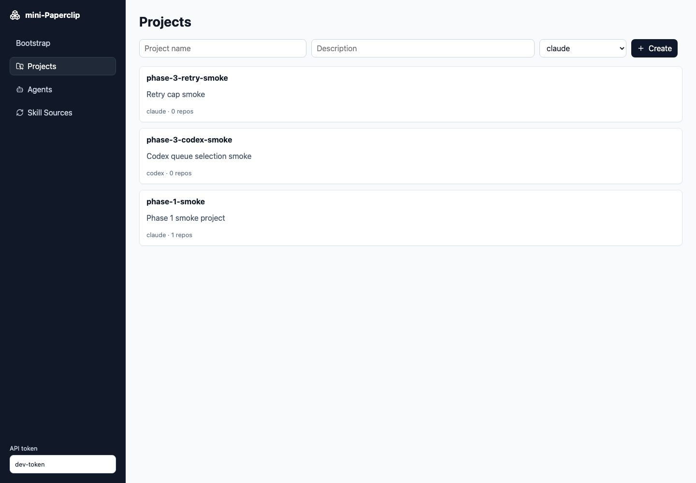

# mini-Paperclip

Local multi-agent engineering orchestrator from `PRD.md`.

## Quickstart

```sh
cp deploy/.env.example deploy/.env
docker compose -f deploy/docker-compose.yml --env-file deploy/.env up -d --build
```

Open `http://localhost:8080` and keep the API token from `deploy/.env` in the sidebar token field.



## Development

```sh
make test
make docker-up
make docker-ps
```

Backend runs on `:8081`; frontend dev server proxies `/api` to it.

### Local host-run development

Use this when you want to run only Postgres in Docker and run the app processes on your host.

```sh
make local-db-up
make local-backend
make local-frontend
```

Open `http://localhost:5173` and use API token `dev-token`.
Backend start targets run `make local-db-check` first and stop with a clear message if the db-only Compose service is not running.

To run the host backend and frontend together in one terminal:

```sh
make local-dev
```

`make local-backend` loads `deploy/.env.local` and runs the backend in `MP_RUNNER_MODE=mock`. This is the safe default for UI/API testing because task runs are deterministic and do not call real CLIs.

#### Lifecycle smoke test

With `make local-dev` already running in another terminal, push one task through the full PM → EM → Backend → Frontend → QA pipeline:

```sh
./scripts/smoke-pipeline.sh
```

The script targets `http://127.0.0.1:18081` with token `dev-token` (override via `BASE_URL` / `API_TOKEN`). It idempotently finds-or-creates a `smoke-pipeline` project, creates a fresh "Add debug health endpoint" task, polls the run to `done`, then re-runs the same task to verify idempotency. Exits non-zero with the event tail on failure. Re-run it after every code change to confirm the orchestrator still walks the lifecycle cleanly.

To run real Codex or Claude from your host shell:

```sh
make local-db-up
make local-backend-cli
make local-frontend
```

Or run both app processes together:

```sh
make local-dev-cli
```

`make local-backend-cli` loads `deploy/.env.local.cli` and uses `MP_RUNNER_MODE=cli`. The host `codex` and/or `claude` commands must already be installed, authenticated, and available on `PATH`; the backend inherits your host environment, so no Docker credential mounts are used.

Local data lives in the `mini-paperclip-local_mp_local_pgdata` Docker volume. `make local-db-down` preserves the volume. If port `5432` is already in use, edit `POSTGRES_PORT` in `deploy/.env.local`; the local backend DSN uses that value. If port `8081` is already in use, edit `MP_PORT`; `make local-frontend` points Vite at that backend port.

## Safety Defaults

- All `/api/*` endpoints require `Authorization: Bearer $MP_API_TOKEN`.
- Repos must be under `MP_REPO_ALLOWLIST`; the backend rejects other paths before git validation.
- CLI runs are capped by `MP_CLI_TIMEOUT`, `MP_RUN_MAX_USD`, and `MP_MONTH_MAX_USD`.
- Runner output is watched for blocked shell patterns such as `curl`, `wget`, `python -c`, `perl -e`, `sudo`, and Docker socket access.
- Backend logs are JSON structured logs on stdout.
- Set `MP_RUNNER_MODE=mock` only for local acceptance smoke tests; default `cli` runs real Claude/Codex CLIs.
- On startup, interrupted `running` runs are marked `error` and stale worktree directories are removed.

## Data

Docker uses named volumes:

- `mini-paperclip_mp_pgdata`
- `mini-paperclip_mp_skills_cache`
- `mini-paperclip_mp_worktrees`

`docker compose down` preserves those volumes. `docker compose down -v` removes them and is destructive.

Skill content is Git/file-cache owned. The database stores skill sources, pinned refs, discovered skill metadata, ignored state, and agent assignments; it does not store full skill bundles. Hosted deployments must keep `MP_SKILLS_CACHE_DIR` on persistent storage, such as the `mini-paperclip_mp_skills_cache` volume above. App restart does not delete the cache, but replacing a container without a persistent cache volume will require an admin sync to fetch pinned skill files again.

Normal hosted skill operations should use the authenticated Admin UI/API. Make targets are local/server wrappers over the same API behavior:

```sh
BASE_URL=http://127.0.0.1:18081 API_TOKEN=dev-token make skills-sync
BASE_URL=http://127.0.0.1:18081 API_TOKEN=dev-token make skills-check
BASE_URL=http://127.0.0.1:18081 API_TOKEN=dev-token make skills-update-check
BASE_URL=http://127.0.0.1:18081 API_TOKEN=dev-token SOURCE=ace3 SHA=<commit-sha> make skills-pin
```

## REST API

See `docs/rest-api.md` for task, artifact, run, heartbeat, and error contracts. Task artifacts are the durable context channel for PM documents, handoffs, engineering plans, QA reports, implementation notes, and run logs.
